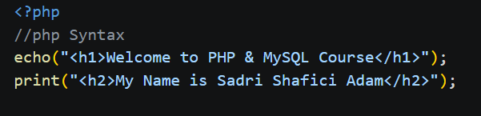
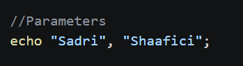
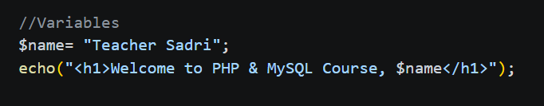
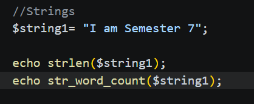

# Week 1 — Code Screenshots

## Introduction

This README provides a detailed walkthrough of the screenshots stored in the **Week 1 / Screenshot** directory for the **PHP & MySQL Course (CA233)**. Rather than presenting the full `index.php` file as one block, each screenshot isolates a single concept — output statements, parameters, variables, and strings — so that each idea can be studied and reviewed independently, in the same order it was introduced in class.

The goal of this documentation is not just to say *what* each screenshot shows, but to explain *why* the code behaves the way it does, what output it produces, and how each section builds on the one before it. Read together, the four screenshots trace a simple learning progression: starting from basic output, moving into how PHP handles multiple values, then introducing variables, and finally combining variables with PHP's built-in string functions.

| # | Filename | What It Covers |
|---|---|---|
| 1 | `php-Img-01.png` | Printing your first lines of output with `echo` and `print` |
| 2 | `php-Img-02.png` | Sending multiple values to the browser in a single `echo` |
| 3 | `php-img-03.png` | Storing a value in a variable and inserting it into a heading |
| 4 | `php-img-04.png` | Measuring a string's length and word count |

---

## 1. `php-Img-01.png` — First PHP Output Statements

**What's in the image:** the opening lines of `index.php`, showing PHP's two most basic ways to send text to the browser — `echo` and `print`.



**Detailed breakdown:**

- **Opening the PHP tag (`<?php`):** Every PHP script embedded inside an HTML file needs a way to tell the web server "everything from here forward should be interpreted as PHP code, not plain text." The `<?php` tag does exactly that. Once this tag appears, the PHP engine takes over parsing until it hits a closing `?>` tag (or the end of the file). This is what allows PHP and HTML to live side-by-side in the same document, which is a defining feature of how PHP is typically used for web development — it's not a separate templating language bolted on top of HTML, it's interwoven directly into it.

- **`echo()` with parentheses:** The line `echo("<h1>Welcome to PHP & MySQL Course</h1>");` prints a level-one HTML heading to the page. It's worth noting that `echo` is technically a *language construct*, not a true function — which means it doesn't behave exactly like a normal PHP function under the hood (for example, it can't be used as part of a more complex expression the way a real function's return value can). Because of this, parentheses around its argument are optional; PHP allows `echo("text")` and `echo "text"` interchangeably, and both produce identical output. Using the parenthesized form here is simply a stylistic choice, not a functional requirement.

- **`print()` for a second output statement:** `print("<h2>My Name is Sadri Shafici Adam</h2>");` follows directly after, outputting a level-two heading that introduces the student by name. Functionally, `print` behaves almost identically to `echo` — it sends a string to the browser — but with one key distinction: `print` always returns the integer value `1` after it runs, whereas `echo` does not return a value at all. This is a subtle but important difference if the output statement is ever used inside a larger expression (for example, inside a conditional), since only `print`'s return value can be tested or used further.

- **The `//php Syntax` comment:** This single-line comment sits above the code and exists purely to label the section for a human reader. The `//` syntax starts a comment that runs to the end of the line; the PHP interpreter completely ignores anything after it. Comments like this don't affect execution in any way — they exist only to make the code easier to navigate, which is especially useful when reviewing a file section by section, as this documentation does.

**Why this matters:** This screenshot establishes the baseline pattern used throughout the rest of the file — HTML tags being generated dynamically from inside PHP, rather than being hardcoded directly into the page. Every later section builds on this same idea of using an output statement to inject content into the page.

---

## 2. `php-Img-02.png` — Passing Several Values to `echo` at Once

**What's in the image:** a quick example of `echo` accepting more than one string at a time, separated by commas.



**Detailed breakdown:**

- **Comma-separated arguments:** The line `echo "Sadri", "Shaafici";` shows `echo` being given two separate string values in a single call, rather than two separate `echo` statements. This is a lesser-known but perfectly valid feature of `echo` — it can accept a comma-separated list of expressions, and it will output every one of them, one after another, in the order they're listed.

- **No automatic spacing between values:** A key detail here is that PHP does **not** insert a space, comma, or any other separator between the values passed to `echo`. Because of this, the browser renders the two strings glued directly together, producing `SadriShaafici` with no gap in between. If a space were desired in the output, it would need to be added manually — either as part of one of the strings (e.g., `"Sadri "`) or by including a separate `" "` as a third comma-separated argument.

- **Distinguishing this from a function's parameter list:** It's easy to look at the word "Parameters" and assume this is about defining a function with formal parameters (like `function greet($first, $last) { ... }`). That's not what's happening here. Since `echo` is a language construct rather than a user-defined function, it doesn't have a fixed parameter signature the way a function does — there's no name or type associated with each value. Instead, `echo` simply accepts however many comma-separated expressions are given to it and prints them all. This distinction matters conceptually, since it separates "arguments passed to a language construct" from "parameters defined in a function signature," which are related but different ideas in PHP.

**Why this matters:** This section reinforces that `echo` is more flexible than a single-string-output tool — understanding that it accepts multiple values, and that those values aren't automatically spaced, helps avoid a common beginner mistake of expecting spacing "for free."

---

## 3. `php-img-03.png` — Declaring a Variable and Interpolating It

**What's in the image:** a value being saved into a variable, then that variable being placed directly inside an output heading.



**Detailed breakdown:**

- **Creating the variable:** `$name= "Teacher Sadri";` stores the text `"Teacher Sadri"` inside a variable called `name`. In PHP, every variable name must be prefixed with a dollar sign (`$`) — this is how the interpreter distinguishes variables from other kinds of identifiers, like function or constant names. The `=` operator performs the assignment, taking the string on the right-hand side and binding it to the variable on the left.

- **No type declaration required:** Unlike statically typed languages such as Java or C#, PHP doesn't require (or even allow, in this basic form) a type to be declared up front for `$name`. The interpreter automatically infers that `$name` should hold a string, purely based on the value assigned to it. This is a direct consequence of PHP being a dynamically typed language — variable types are determined at runtime based on their current value, and that type can even change later if a different kind of value is assigned to the same variable.

- **Variable interpolation inside a double-quoted string:** The line `echo("<h1>Welcome to PHP & MySQL Course, $name</h1>");` places the variable `$name` directly inside a string, without breaking out of the string using concatenation. PHP recognizes the `$name` token inside the double-quoted string and automatically substitutes in its current value, producing the final output: `Welcome to PHP & MySQL Course, Teacher Sadri`. This behavior — known as *variable interpolation* — only works inside **double-quoted** strings. If the same string had been written with single quotes (`'... $name ...'`), PHP would treat `$name` as literal text and print it exactly as written, rather than substituting the stored value. This is one of the most important practical differences between single- and double-quoted strings in PHP.

- **Reusing the output pattern from earlier:** This block reuses the same `echo(...)` structure introduced in the first screenshot, showing how a previously learned tool (output statements) can be combined with a newly introduced one (variables) to produce dynamic, rather than hardcoded, content.

**Why this matters:** Variable interpolation is one of the most commonly used features in real-world PHP code, especially for generating dynamic HTML — this screenshot is the first point in the file where output stops being a fixed string and starts being built from data that could, in principle, change (for example, coming from a form, a database, or user input later in the course).

---

## 4. `php-img-04.png` — Passing a Variable into Built-In String Functions

**What's in the image:** a stored string being run through two built-in functions — one that counts characters, one that counts words.



**Detailed breakdown:**

- **Declaring the string variable:** `$string1= "I am Semester 7";` follows the exact same assignment pattern used for `$name` in the previous section — a variable name prefixed with `$`, followed by `=`, followed by the string value being stored. This consistency across sections is intentional: it shows that once the pattern for declaring a variable is learned, it applies uniformly regardless of what the variable will later be used for.

- **`strlen()` — measuring string length:** `echo strlen($string1);` calls PHP's built-in `strlen()` function, passing `$string1` in as its argument. `strlen()` counts every character in the string — including letters, numbers, punctuation, and spaces — and returns that count as an integer, which is then immediately printed with `echo`. For the string `"I am Semester 7"`, this counts out to **15** characters in total (every letter and every space between words, plus the digit `7`).

- **`str_word_count()` — counting words instead of characters:** `echo str_word_count($string1);` calls a second built-in function on the same variable, but this one counts whole words rather than individual characters. By default, `str_word_count()` splits the string on whitespace and counts how many word-like tokens result. For `"I am Semester 7"`, this returns **4** — counting "I", "am", "Semester", and "7" as four separate words.

- **The general pattern being demonstrated:** Both lines follow the same underlying structure: take a variable that was already declared, pass it as an argument into a built-in PHP function, and immediately `echo` whatever value that function returns. This is a foundational pattern in PHP — functions rarely modify their input directly; instead, they compute and return a new value, which then has to be explicitly output (or stored, or used) by the surrounding code.

**Why this matters:** This section is the first point in the file where a variable is used as *input* to a function rather than being interpolated directly into an output string. It demonstrates that once data is stored in a variable, it can be reused and passed around to different tools — in this case, two different built-in functions that each extract a different kind of information from the same underlying string.

---

## Concepts at a Glance

| Concept | Where It Appears | Key Idea |
|---|---|---|
| Entering PHP mode | `php-Img-01.png` | `<?php` switches the parser from HTML into PHP |
| `echo` vs. `print` | `php-Img-01.png` | Both output text; `print` always returns `1`, `echo` does not |
| Multiple values to `echo` | `php-Img-02.png` | `echo` accepts comma-separated values with no automatic spacing |
| Variable declaration | `php-img-03.png` | Variables are prefixed with `$` and dynamically typed |
| Variable interpolation | `php-img-03.png` | Double-quoted strings substitute variable values; single-quoted strings don't |
| `strlen()` | `php-img-04.png` | Returns the total character count of a string |
| `str_word_count()` | `php-img-04.png` | Returns the total word count of a string |

---

## Screenshot Folder Structure

```
Week 1/
└── Screenshot/
    ├── php-Img-01.png
    ├── php-Img-02.png
    ├── php-img-03.png
    └── php-img-04.png
```

Each screenshot above corresponds directly to its matching numbered section in this README, and the sections are ordered to match the sequence these concepts appear in the source file. The underlying code these screenshots were captured from, `index.php`, lives in the parent `Week 1` folder.
