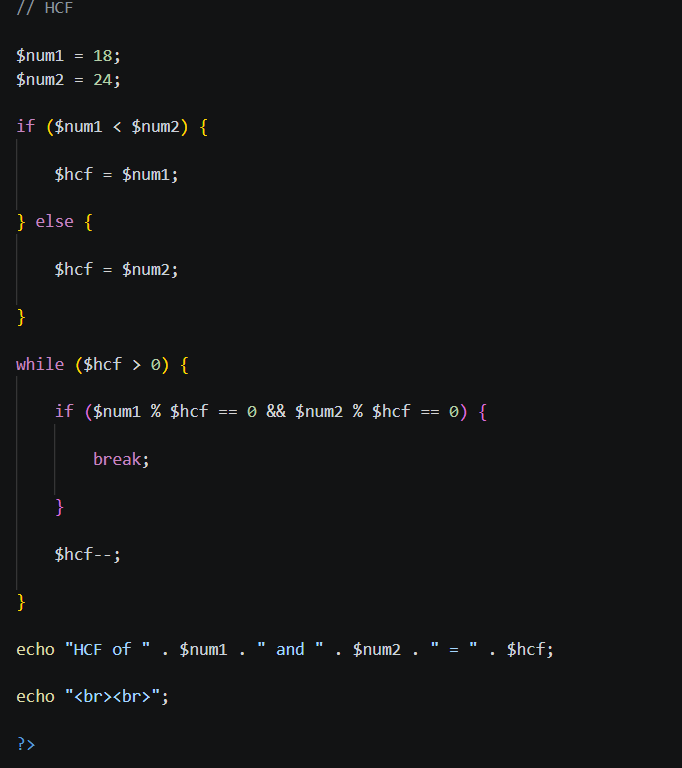
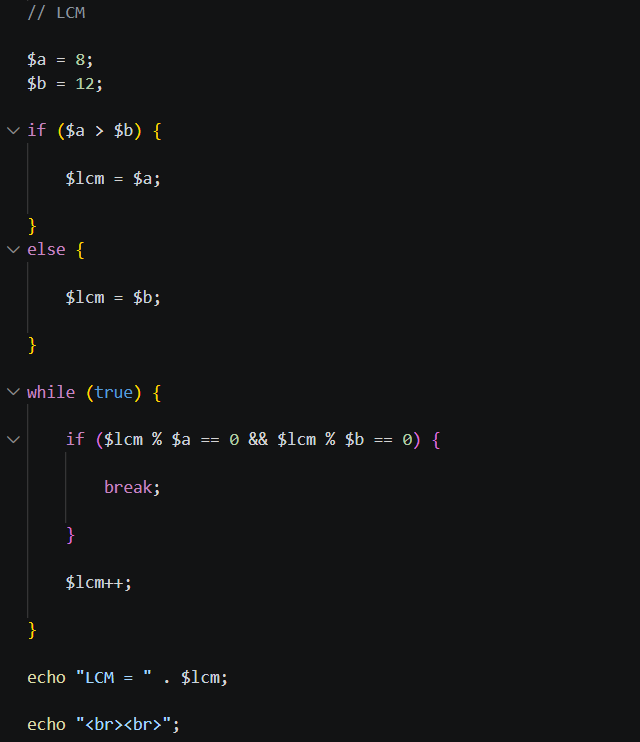
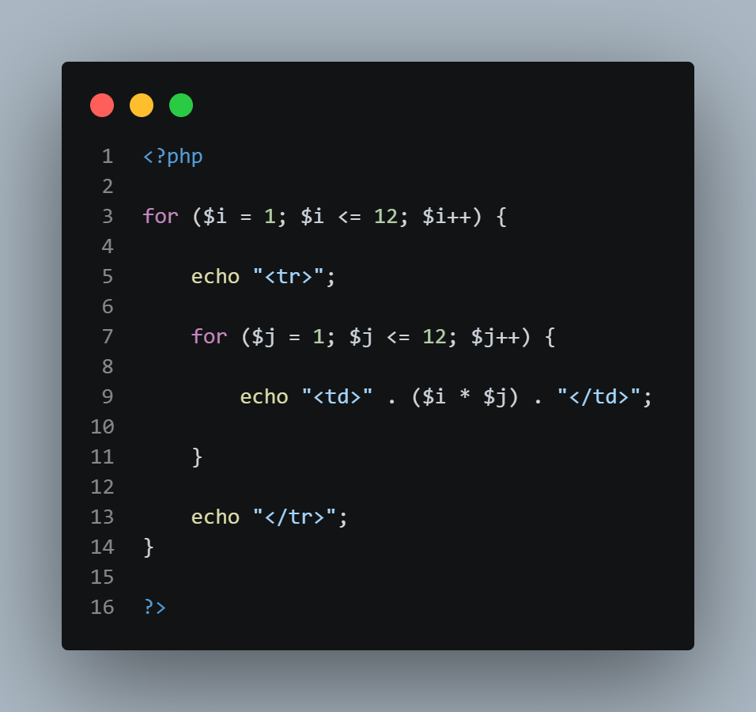
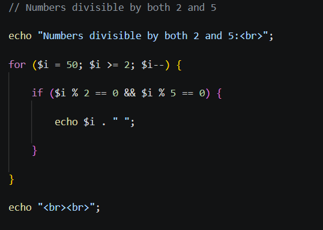
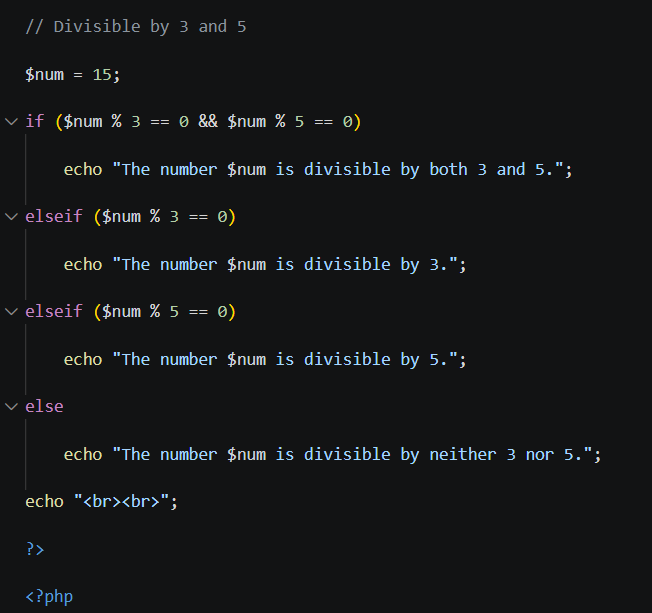
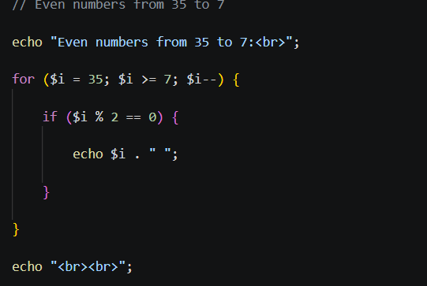
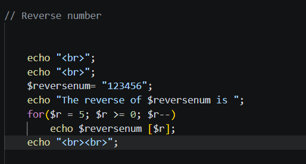
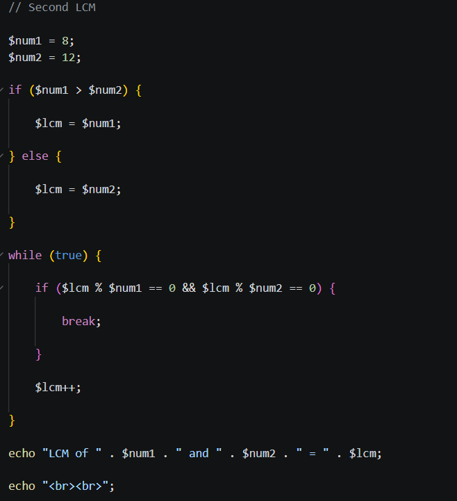

# Week 3 — Code Screenshots

## Introduction

This README documents the screenshots inside the **Week 3 / screenshots** directory for the **PHP & MySQL Course (CA233)**. Week 3 moves past basic control flow into small, self-contained problems that combine conditionals and loops to compute something specific — comparing numbers, checking divisibility, generating number sequences, reversing a string, finding an LCM and HCF, and building a multiplication table with nested loops and HTML.

Each screenshot below is listed in the exact order it appears in the **week3/screenshots** folder itself.

| # | Filename | What It Covers |
|---|---|---|
| 1 | `HCF.png` | Finding the Highest Common Factor (HCF) of two numbers |
| 2 | `LCM 1.png` | Finding the Lowest Common Multiple (LCM) of two numbers |
| 3 | `MTABLE.png` | Generating a 12×12 multiplication table as an HTML table |
| 4 | `divisible by 2 and 5.png` | Listing numbers divisible by both 2 and 5 |
| 5 | `divisible by 3 and 5.png` | Checking whether a single number is divisible by 3, 5, both, or neither |
| 6 | `even numbers from 35 to 7.png` | Listing even numbers counting down from 35 to 7 |
| 7 | `reverse number.png` | Reversing the digits of a number |
| 8 | `second LCM.png` | Finding the LCM a second time, with renamed variables |

---

## 1. `HCF.png` — Highest Common Factor



**What's in the image:** a script that finds the Highest Common Factor (HCF, also called the Greatest Common Divisor) of two fixed numbers, `8` and `12`, by counting downward.

**Detailed breakdown:**

- **Picking a sensible starting guess:** `if ($num1 < $hcf) { $hcf = $num1; } else { $hcf = $num2; }` — the code starts its search from whichever of the two numbers is smaller, since the HCF of two numbers can never be larger than the smaller of the two. This keeps the search as short as possible instead of starting from an arbitrarily large number.
- **Counting downward with `while ($hcf > 0)`:** Starting from that smaller value, the loop checks whether `$hcf` divides evenly into both `$num1` and `$num2` using `$num1 % $hcf == 0 && $num2 % $hcf == 0`. If both remainders are zero, `$hcf` is a common factor of both numbers.
- **Stopping at the first (largest) match:** Because the search starts high and counts down with `$hcf--`, the very first value that satisfies both conditions is guaranteed to be the *largest* common factor — which is exactly the definition of the HCF. The loop immediately `break`s once that value is found.
- **Result for this run:** For `8` and `12`, the common factors are `1`, `2`, and `4` — the search starts at `8` and counts down until it hits `4`, which divides evenly into both numbers, so `"HCF of 8 and 12 = 4"` is printed.

**Why this matters:** This is a classic "search downward until a condition is met" pattern — instead of calculating the HCF mathematically (e.g. via the Euclidean algorithm), it brute-forces the answer by testing every candidate from the smaller number down to `1`.

---

## 2. `LCM 1.png` — Lowest Common Multiple



**What's in the image:** a script that finds the Lowest Common Multiple (LCM) of `8` and `12` by counting upward, using the mirror-image approach of the HCF search above.

**Detailed breakdown:**

- **Picking a sensible starting guess:** `if ($a > $b) { $lcm = $a; } else { $lcm = $b; }` — the search starts from whichever of the two numbers is *larger*, since the LCM of two numbers can never be smaller than the larger of the two.
- **Counting upward with `while (true)`:** Rather than writing a condition directly in the `while(...)`, the loop is written to run forever (`while (true)`) and instead relies on an `if` check inside the loop body — `if ($lcm % $a == 0 && $lcm % $b == 0) { break; }` — to decide when to stop. This is a common alternative style to putting the exit condition in the loop header, especially when the exit check needs to happen partway through the loop body rather than right at the top.
- **Incrementing until a match is found:** If the current `$lcm` isn't divisible by both `$a` and `$b`, `$lcm++;` moves the candidate up by one and the loop tries again.
- **Result for this run:** Starting from `12` (the larger of the two), the search climbs upward — `12`, `13`, `14`... — until it reaches `24`, the first number divisible by both `8` and `12`, so `"LCM = 24"` is printed.

**Why this matters:** Using `while (true)` with an internal `break` is a useful pattern whenever the exit condition depends on logic that doesn't fit cleanly into a single boolean expression in the loop header — here, two separate divisibility checks combined together.

---

## 3. `MTABLE.png` — Multiplication Table as an HTML Table



**What's in the image:** a nested loop that builds a full 12×12 multiplication grid, outputting each row and cell as real HTML table markup rather than as plain line-by-line text.

**Detailed breakdown:**

- **The outer loop builds rows:** `for ($i = 1; $i <= 12; $i++) { echo "<tr>"; ... echo "</tr>"; }` runs once for every row of the table, opening a `<tr>` (table row) tag before the row's cells are generated and closing it afterward.
- **The inner loop builds the cells within each row:** `for ($j = 1; $j <= 12; $j++) { echo "<td>" . ($i * $j) . "</td>"; }` runs a full 1-through-12 cycle for every single value of `$i`, printing one `<td>` (table cell) per column containing the product `$i * $j`.
- **Total cells generated:** Since the outer loop runs 12 times and the inner loop runs 12 times for each of those, the `<td>` cell is written out `12 × 12 = 144` times in total — enough to fill a complete 12-row, 12-column table.
- **Why this differs from earlier nested-loop examples:** In Week 2's nested loop screenshot, the output was plain text separated by `<br>`. Here, the same nested-loop structure is instead used to emit properly structured HTML (`<tr>` and `<td>` tags), which is what allows a browser to actually render the result as a visual grid rather than a plain list of numbers.

**Why this matters:** This shows nested loops being used for a genuinely practical purpose — generating repetitive, structured markup — which is one of the most common real-world uses of nested loops in web development.

---

## 4. `divisible by 2 and 5.png` — Numbers Divisible by Both 2 and 5



**What's in the image:** a loop that scans downward from `50` to `2`, printing every number that's evenly divisible by both `2` and `5` at the same time.

**Detailed breakdown:**

- **Looping downward:** `for ($i = 50; $i >= 2; $i--) { ... }` starts at `50` and counts down to `2`, decrementing `$i` by `1` on every pass — the opposite direction from a typical counting-up `for` loop, but structurally identical otherwise.
- **Checking two conditions with `&&`:** `if ($i % 2 == 0 && $i % 5 == 0)` only lets a number through if **both** `$i % 2 == 0` (divisible by 2) and `$i % 5 == 0` (divisible by 5) are true at once. The `&&` (logical AND) operator requires both sides to be true — if either check fails, the number is skipped.
- **A shortcut worth noticing:** Any number divisible by both `2` and `5` is necessarily divisible by `10` as well, so the numbers this loop prints are exactly the multiples of `10` between `2` and `50`: `50, 40, 30, 20, 10`.

**Why this matters:** This demonstrates combining two independent divisibility checks with `&&` inside a loop — a pattern that generalizes directly to filtering any list of numbers by more than one condition at once.

---

## 5. `divisible by 3 and 5.png` — Checking a Single Number's Divisibility



**What's in the image:** a single number, `15`, being tested against four possible outcomes — divisible by both 3 and 5, by 3 only, by 5 only, or by neither.

**Detailed breakdown:**

- **Testing the "both" case first:** `if ($num % 3 == 0 && $num % 5 == 0)` is checked before the individual `3`-only or `5`-only cases. This ordering matters: if the "divisible by 3" check were written first on its own, a number divisible by both would incorrectly get labeled as only divisible by 3, since that branch would match and stop the chain before the "both" case ever got a chance to run.
- **Falling through to single-condition checks:** `elseif ($num % 3 == 0)` and `elseif ($num % 5 == 0)` only get evaluated if the "both" case above didn't match, at which point each one checks a single divisibility condition on its own.
- **The `else` for neither:** If none of the three conditions above match, the number is divisible by neither 3 nor 5, and the final `else` branch handles that case.
- **Result for this run:** `15` is divisible by both `3` (`15 ÷ 3 = 5`) and `5` (`15 ÷ 5 = 3`), so the very first condition matches, and `"The number 15 is divisible by both 3 and 5."` is printed.

**Why this matters:** This is a good example of why the *most specific* condition (divisible by both) needs to come first in a chain of `if`/`elseif` checks — a mistake worth watching for any time multiple overlapping conditions are being tested.

---

## 6. `even numbers from 35 to 7.png` — Counting Down Through Even Numbers



**What's in the image:** a loop that counts downward from `35` to `7`, printing only the even numbers it passes through along the way.

**Detailed breakdown:**

- **Counting down instead of up:** `for ($i = 35; $i >= 7; $i--) { ... }` starts at the higher number (`35`) and decreases toward the lower one (`7`), using `$i--` to step down by `1` each time. This is the reverse of the more familiar "count from low to high" loop pattern, but the loop otherwise works exactly the same way — initialize, check the condition, run the body, then step.
- **Filtering for even numbers:** `if ($i % 2 == 0) { echo $i . " "; }` only prints a number if dividing it by `2` leaves no remainder, which is the standard test for evenness in PHP (and most programming languages).
- **Result for this run:** Counting down from `35`, the first even number reached is `34`, and the sequence continues `34, 32, 30, ... , 8` — stopping once `$i` drops below `7`.

**Why this matters:** Combined with the multiples-of-10 example above, this shows the same "loop plus a divisibility filter" pattern being applied in the opposite counting direction, reinforcing that a `for` loop's direction and step size are just as configurable as its start and end points.

---

## 7. `reverse number.png` — Reversing a Number's Digits



**What's in the image:** a string of digits being read backward, one character at a time, to print it in reverse order.

**Detailed breakdown:**

- **Storing the number as a string:** `$reversenum = "123456";` stores the value in double quotes, as a string rather than a numeric type. This matters because the next step accesses individual characters by position, which works naturally on strings in PHP but not directly on plain integers.
- **Accessing individual characters by index:** `$reversenum[$r]` uses square-bracket indexing to pull out a single character from the string at position `$r`. String indexes in PHP start at `0`, so for `"123456"` (6 characters), the valid positions run from `0` (the character `"1"`) to `5` (the character `"6"`).
- **Looping backward through the indexes:** `for ($r = 5; $r >= 0; $r--) echo $reversenum[$r];` starts at the *last* valid index (`5`) and counts down to the *first* (`0`), printing each character as it goes. Because it visits the string from its last character to its first, the digits come out in reverse: `654321`.
- **A detail worth flagging:** The loop's starting index, `5`, is hardcoded to match the exact length of `"123456"`. If `$reversenum` were changed to a string of a different length, `5` would need to be updated too (or replaced with a calculated value such as `strlen($reversenum) - 1`) for the reversal to still work correctly.

**Why this matters:** This is a first look at treating a string as a sequence of individually accessible characters rather than a single indivisible block of text — a foundation for many common string-processing tasks like palindromes, character counting, or building custom formatting.

---

## 8. `second LCM.png` — Finding the LCM Again, with Renamed Variables



**What's in the image:** the exact same Lowest Common Multiple logic as the `LCM 1.png` screenshot, run again with the two numbers stored under different variable names.

**Detailed breakdown:**

- **Same numbers, different variable names:** `$num1 = 8;` and `$num2 = 12;` hold the identical values used earlier (previously named `$a` and `$b`), showing that the *names* chosen for variables don't change how the underlying logic behaves — only what the code looks like to a human reading it.
- **Identical algorithm:** The rest of the script — picking the larger number as a starting guess, looping with `while (true)` and an internal `if`/`break`, incrementing with `$lcm++` — is exactly the same approach used in the first LCM screenshot.
- **A more descriptive final message:** The output line here, `"LCM of " . $num1 . " and " . $num2 . " = " . $lcm;`, spells out both input numbers in the printed message, whereas the first version's output (`"LCM = " . $lcm;`) only showed the final result. This is a small but useful improvement in clarity, especially if the script were later reused with different numbers.
- **Result for this run:** As before, `8` and `12` produce an LCM of `24`, so `"LCM of 8 and 12 = 24"` is printed.

**Why this matters:** Repeating the same algorithm with clearer variable names and a more descriptive output message is a common refinement step once a piece of logic is working correctly — the math doesn't change, but the code becomes easier for someone else (or a future version of yourself) to read and understand.

---

## Concepts at a Glance

| Concept | Where It Appears | Key Idea |
|---|---|---|
| Search downward to a condition | `HCF.png` | Starts from the smaller number and decrements until both divisibility checks pass |
| `while (true)` with an internal `break` | `LCM 1.png`, `second LCM.png` | Loops indefinitely until an `if` check inside the body decides to stop |
| Nested loops generating HTML | `MTABLE.png` | An outer loop builds table rows (`<tr>`) while an inner loop fills in cells (`<td>`) |
| Combining conditions with `&&` | `divisible by 2 and 5.png` | Both divisibility checks must be true at once for a number to print |
| Ordering `if`/`elseif` from most to least specific | `divisible by 3 and 5.png` | The "divisible by both" case must be checked before either single-condition case |
| Counting down in a `for` loop | `even numbers from 35 to 7.png` | `$i--` steps a loop backward from a high starting value to a lower limit |
| String indexing (`$string[$i]`) | `reverse number.png` | Individual characters can be accessed by position, with indexing starting at `0` |
| Refining working code | `second LCM.png` | Renaming variables and improving output messages without changing the underlying logic |

---

## Screenshot Folder Structure

```
Week3/
└── screenshots/
    ├── HCF.png
    ├── LCM 1.png
    ├── MTABLE.png
    ├── divisible by 2 and 5.png
    ├── divisible by 3 and 5.png
    ├── even numbers from 35 to 7.png
    ├── reverse number.png
    └── second LCM.png
```

Each screenshot above corresponds to its matching numbered section in this README, listed in the same order they appear in the **week3/screenshots** folder. The underlying source code these screenshots were captured from lives in the parent `Week3` folder.
